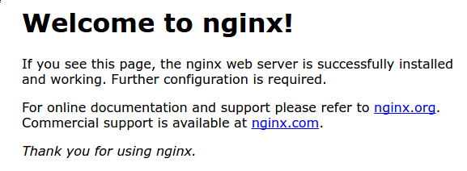

# Install Nginx

```bash
sudo apt update
sudo apt install nginx
```

## Adjusting the Firewall

```bash
sudo ufw app list
```

### You should get a listing of the application profiles:

```bash
Output

Available applications:
Nginx Full
Nginx HTTP
Nginx HTTPS
OpenSSH
```

`Nginx Full:` This profile opens both port 80 (normal, unencrypted web traffic) and port 443 (TLS/SSL encrypted traffic)

`Nginx HTTP:` This profile opens only port 80 (normal, unencrypted web traffic)

`Nginx HTTPS:` This profile opens only port 443 (TLS/SSL encrypted traffic)

## Enable Profile

```bash
sudo ufw allow <profile>
```

## Verify the status

```bash
sudo ufw status
```

## start Nginx services

```bash
sudo systemctl start nginx
```

#### OR

```bash
sudo service nginx start
```

## Check Nginx Service Status

```bash
sudo systemctl status nginx
```

#### OR

```bash
sudo service nginx status
```

```bash
Output

● nginx.service - A high performance web server and a reverse proxy server
   Loaded: loaded (/lib/systemd/system/nginx.service; enabled; vendor preset: enabled)
   Active: active (running) since Fri 2020-04-20 16:08:19 UTC; 3 days ago
     Docs: man:nginx(8)
 Main PID: 2369 (nginx)
    Tasks: 2 (limit: 1153)
   Memory: 3.5M
   CGroup: /system.slice/nginx.service
           ├─2369 nginx: master process /usr/sbin/nginx -g daemon on; master_process on;
           └─2380 nginx: worker process
```

## Verify by Opening Default Nginx landing page

```bash
http://your_server_ip
```



## Managing the Nginx Process

### Restart Nginx Service

```bash
sudo systemctl reload nginx
```

#### OR

```bash
sudo service nginx reload
```

### Stop Nginx Service

```bash
sudo systemctl stop nginx
```

#### OR

```bash
sudo service nginx stop
```

### Enable the service to start up at boot

```bash
sudo systemctl enable nginx
```

#### OR

```bash
sudo service nginx enable
```

### Check Nginx Runs Succesfully

```bash
sudo nginx -t
```
